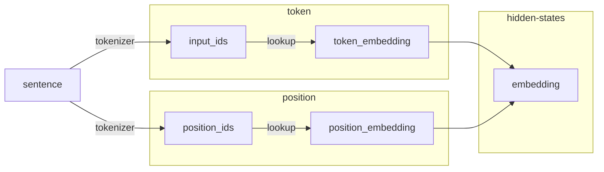

Transformer原始输入为文本，可是计算机只能够处理数字相关的信息，于是需要一个嵌入层将输入的文本转换成对应的向量表示。如对于输入的文本“我爱机器学习”，首先需要经过嵌入层分词后，获得每个词对应的输入编码向量（词向量）$x_1、x_2、x_3、x_4$和位置编码向量$p_1、p_2、p_3、p_4$，再将二者按照位置叠加，得到每个token的最终编码向量。

Encoder/Decoder的输入主要分为两个部分：token embedding和position embedding。前者针对于token存储其相关语义向量，后者对位置进行编码，计算示例如下所示：


:::tip
目前有一些模型的输入包含另外一个参数：`token type embedding`，用来标识两个不同来源的数据，比如：BERT、TinyBERT、RoBERTa、Roformer等模型。不过其原理比较简单，
:::

嵌入层的处理逻辑通常包含：

* 通过Tokenizer将文本处理成`input_ids`
* 计算`position_ids`
* 计算`word_embedding`和`position_embedding`
* 计算最终的`embedding`。

## 计算逻辑

以下流程图模拟了代码运算过程中的相关逻辑：



其中`sentence`为原始文本，通过`tokenizer`之后即可得到`input_ids`和`position_ids`两个数据，例如:

```py showLineNumbers {4}
input_ids = [465, 263, 2163, 28736]
position_ids = [0, 1, 2, 3]

embedding = word_embedding(input_ids) + position_embedding(position_ids)
```

`input_ids`会在`WordEmbedding`当中根据索引检索出对应`token`的语义向量，`position_ids`会在`PositionEmbedding`当中根据索引检索出对应`position`的位置向量。这两者都是查表过程，相对比较简单。

## Tokenizer

Tokenizer旨在将文本转化成`input_ids`，从而在`Word Embedding`中检索出对应每个词的向量表示，处理流程通常是先将一段文本切分成不同的token，然后在词库当中查找这个单词，如果存在就返回token对应的index，如果没有就将其视作为unk，然后返回其index。那如何将文本切分成不同的token成为这其中的重点。

不同的模型有不同的分词算法，比如说常见的BERT中使用的Wordpiece算法，GPT-2中使用的BPE算法等。

> 后续有机会也会分享一下不同分词算法。

## Token Embedding

作者使用可学习的`Embedding`作为`token`语义编码模块，每个`token`都有$d_{model}$个可学习的参数，整个词表可学习的参数为：$vocab_{size} * d_{model}$。

此模块会基于`input_ids`（例如，[5,32,45,234,234]等）在词表中抽取出对应索引的向量。

`Token Embedding`也可称为`Word Embedding`，也有相关的发展历程，从最早的基于词频率统计的有[Count Vector](https://scikit-learn.org/stable/modules/generated/sklearn.feature_extraction.text.CountVectorizer.html)、关键词特征方法 [TF-IDF Vector](https://scikit-learn.org/stable/modules/generated/sklearn.feature_extraction.text.TfidfVectorizer.html?highlight=tf+idf+vector)以及词共现矩阵（Co-Occurence Vector）等不同类别的方法。可是这些都是稀疏特征，此类特征的复杂度会随着词表的增大而增大，实践证明很难获得一个比较好的效果，于是便出现了Glove、Word2Vec等方法，面向稠密语义训练，将词的语义和预测融入训练过程中来，实现了高精度语义和低纬度向量。

> Token Embedding相对比较简单，在此不作过多的讲解。

## Position Embedding

Transformer编码器使用自注意力机制处理数据，虽然能够大幅度加强模型的并行计算能力，但是其忽略了文本序列中token之间的位置关系，从而导致建模的过程中出现偏差。因此需要使用位置编码（Position Embedding）进行校正，标记输入的文本序列中每个token的位置，这个信息对于理解语言是很关键的。

在自然语言中，文字的顺序至关重要，甚至决定了语法正确性、语义的表达。在RNN网络中由于本身在计算层面就已经考虑了顺序，所以就不需要位置编码了，可是Transformer中没有使用到循环神经网络或卷积网络，而是使用了Multi-Head Attention来计算特征，其并不能添加此的位置信息，所以为了表达文本的顺序信息，使用了`position embedding` 在Transformer中表达token的位置信息，论文中的计算公式如下所示：

Transformer使用三角函数（正弦或者余弦）来编码位置信息。假设位置编码的维度为$D$，则每一维的值的计算公式为

$$
PE(pos, 2i) = sin(pos/10000^{2i/d_{model}})
\\
PE(pos, 2i + 1) = cos(pos/10000^{2i/d_{model}})
$$

其中$pos$为相对位置信息，如: $\{0, 1, 2, ..., 200\}$，$i$为向量的维度索引，如: $\{0, 1, 2, ..., 768\}$。使用此方式计算位置信息有如下好处：

* 能够计算出不同token的相对位置编码，比如$PE(pos)$和$PE(pos+k)就可以通过正弦公式而来: 
    * $cos(A+B) = cos(A)cos(B) - sin(A)sin(B)$
    * $sin(A+B) = sin(A)cos(B) + cos(A)sin(B)$

当然针对于位置编码的计算方式不止这一种，苏剑林的[RoFormer](https://arxiv.org/pdf/2104.09864.pdf)文章就提出旋转位置编码充分利用位置编码信息，用一个旋转矩阵能够编码绝对位置编码。

## 知识点扩展

在Transformer中也有一些优秀预训练模型做了一些创新，可是创新真的，还挺小的，唯一大一点的就是苏剑林的旋转编码。色

### Token Type Ids

这个或许大家已经耳熟能详，因为这在BERT当中存在，主要用于标识两个不同的文本，然后用于`NSP`任务的预测。此创新源于模型训练任务的不同。

### Rotary Position Encoding

[苏剑林](https://kexue.fm/)提出使用旋转位置编码来有效利用位置信息，具体方法就是使用旋转矩阵来存储位置编码信息，然后在SelfAttention计算中将此信息添加到相似度计算当中，最终模型在语义编码上的效果非常好。

> [RoFormer: Enhanced Transformer with Rotary Position Embedding](https://arxiv.org/abs/2104.09864)

### ALiBi

> [Train Short, Test Long: Attention with Linear Biases Enables Input Length Extrapolation](https://arxiv.org/abs/2108.12409)

解决在预测时文本过长的问题，通过引入Attention with Linear Biases (ALiBi)方法，此方法并不是直接将Position Embedding和Word Embedding相加，而是在self-attention中query-key相似度计算的过程中添加偏移惩罚因子，并视此为构建位置位置向量的核心方法。

关于位置编码还有很多深入性的讨论，在这里不做过于深度的讲解，有兴趣的小伙伴可以看以下文章：

* [Transformer Architecture: The Positional Encoding](https://kazemnejad.com/blog/transformer_architecture_positional_encoding/)
* [Github Issue: Why add positional embedding instead of concatenate? ](https://github.com/tensorflow/tensor2tensor/issues/1591)
* [Reddit thread - Positional Encoding in Transformer](https://www.reddit.com/r/MachineLearning/comments/cttefo/d_positional_encoding_in_transformer/)
* [Reddit thread - Positional Encoding in Transformer model](https://www.reddit.com/r/learnmachinelearning/comments/9e4j4q/positional_encoding_in_transformer_model/)

### NormBefore/NormAfter/三明治Norm

在TransformerLayer的计算过程中，Norm的计算也是有一定的技巧，常规的计算公式如下：

$$
Y = Norm(MutliHead(H_i)) + H_i

\\

H_{i+1} = Norm(FeedForward(Y)) + Y
$$

此类计算方式称之为：NormAfter。

可是也是有NormBefore的，比如说GPT-2，就是先计算Norm然后再计算MultiHead，计算公式如下：

$$
Y = MutliHead(Norm(H_i)) + H_i

\\

H_{i+1} = FeedForward(Norm(Y)) + Y
$$

当然，还有一种计算方式，比如MBart模型前后都要计算Norm，俗称三明治Norm。计算公式如下所示：

$$
Y = MutliHead(Norm(H_i)) + H_i

\\

H_{i+1} = Norm(FeedForward(Norm(Y))) + Y
$$

## 激活函数

也有一些模型在激活函数上做一些文章，比如说：BERT中的激活函数是使用Gelu，可是Roformer中使用的Relu。

你说哪个激活函数好？可能还是需要看具体任务和数据集。

## 参考链接

* [Word Embedding的发展和原理简介](https://zhuanlan.zhihu.com/p/385146997)
* [Transformer模型详解（图解最完整版）](https://zhuanlan.zhihu.com/p/338817680)