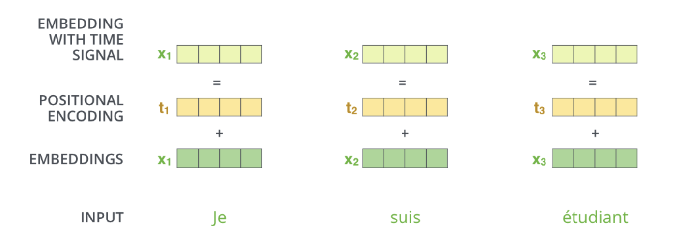
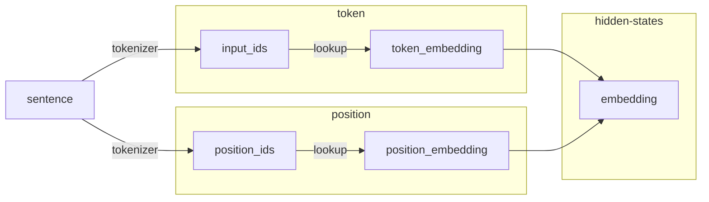

# 模型的输入

Transformer中的输入分为Encoder和Decoder的输入，其原理和计算过程一致，且两者的Embedding模块可共享参数（当然也是可以不共享）。

模型的输入主要分为两个部分：token embedding和position embedding。前者针对于token存储其相关语义向量，后者对位置进行编码，计算示例如下所示：



## 输入计算逻辑

以下流程图模拟了代码运算过程中的相关逻辑：



其中`sentence`为原始文本，通过`tokenizer`之后即可得到`input_ids`和`position_ids`两个数据，例如:

```py
input_ids = [465, 263, 2163, 28736]
position_ids = [0, 1, 2, 3]
```

`input_ids`会在`WordEmbedding`当中根据索引检索出对应`token`的语义向量，`position_ids`会在`PositionEmbedding`当中根据索引检索出对应`position`的位置向量。这两者都是查表过程，相对比较简单。

## Token Embedding

`Token Embedding`也可称为`Word Embedding`，也有相关的发展历程，从最早的基于词频率统计的有Count Vector、关键词特征方法 TF-IDF Vector以及词共现矩阵Co-Occurence Vector等不同类别的方法。

## Position Embedding


## 参考链接

* [Word Embedding的发展和原理简介](https://zhuanlan.zhihu.com/p/385146997)